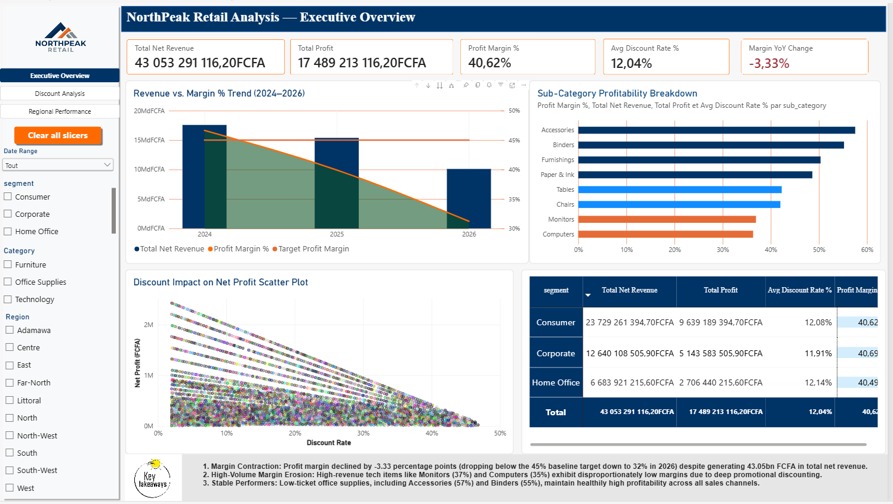
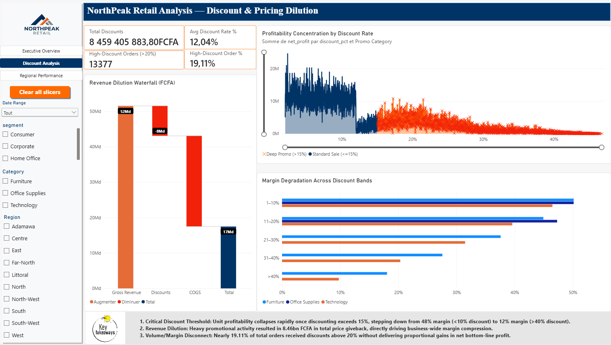
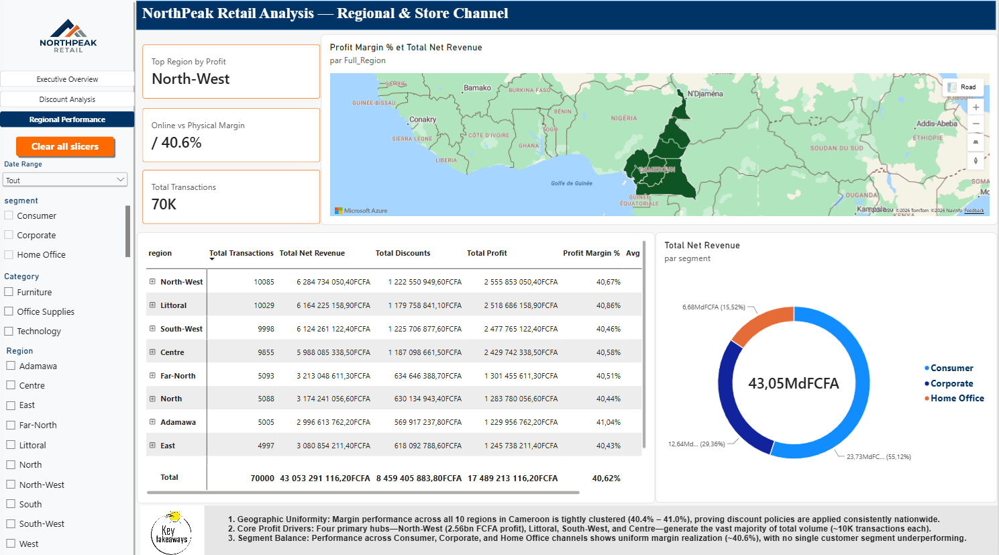
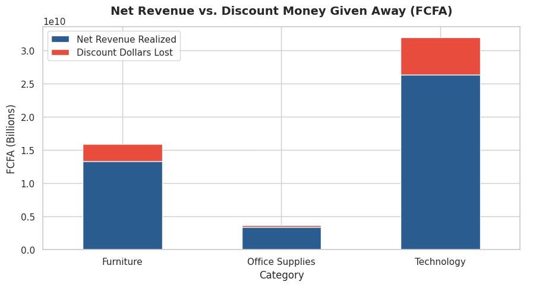
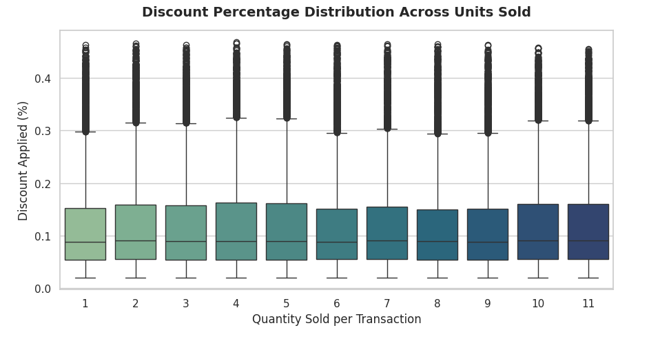
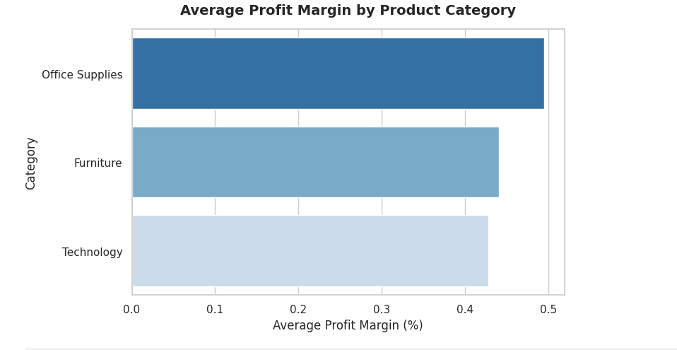
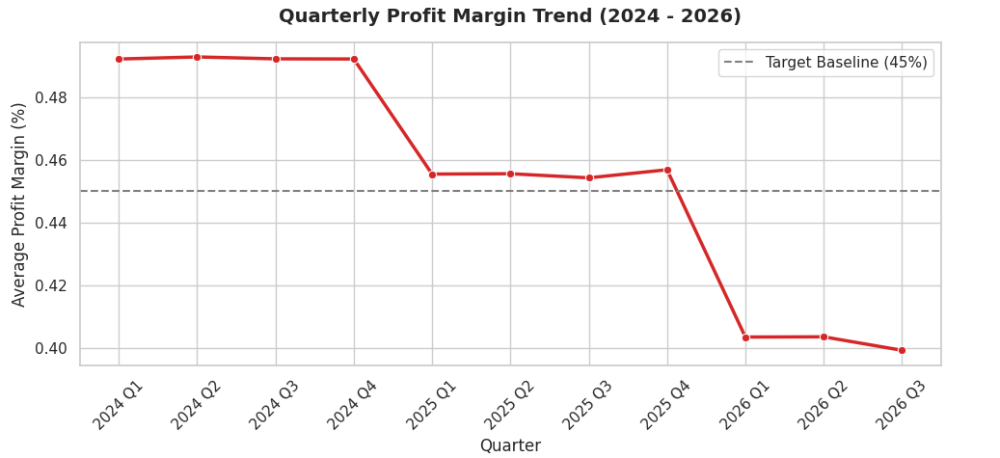
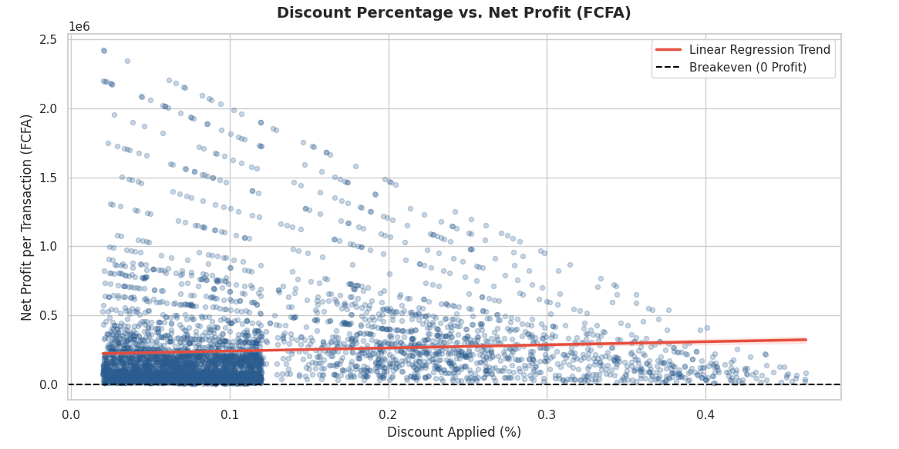
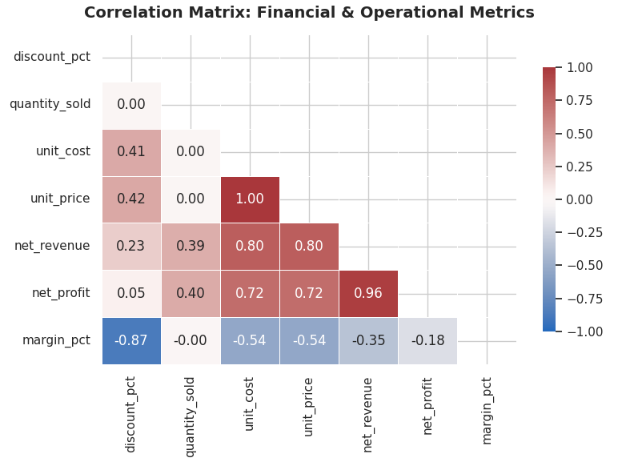

# NorthPeak Retail Analysis Dashboard

> An end-to-end retail analytics project built for NorthPeak — a Cameroonian retail company operating across all 10 regions of the country. This project covers synthetic data generation, a PostgreSQL star schema data warehouse, Python exploratory analysis, and an interactive Power BI dashboard. The central business question: **why are profit margins eroding, and where?**

---

## Table of Contents

1. [Project Overview](#project-overview)
2. [Business Problem](#business-problem)
3. [Tech Stack](#tech-stack)
4. [Project Structure](#project-structure)
5. [Data Architecture](#data-architecture)
6. [Key Findings](#key-findings)
7. [Power BI Dashboard](#power-bi-dashboard)
8. [Python Analysis — Notebook Visuals](#python-analysis--notebook-visuals)
9. [Getting Started](#getting-started)
10. [Documentation](#documentation)
11. [License](#license)

---

## Project Overview

NorthPeak is a fictional Cameroonian retail company selling across three product categories — **Furniture**, **Technology**, and **Office Supplies** — through both physical stores and online channels in all 10 administrative regions of Cameroon.

This project simulates and analyzes **70,000 sales transactions** spanning January 2024 to September 2026, with an intentionally embedded **profit margin erosion scenario** driven by escalating discounts on high-value product lines over time. The goal is to surface this business problem through data, quantify its impact, and communicate findings to stakeholders via a professional Power BI dashboard.

**What was built:**
- A Python script that generates and loads all data into PostgreSQL
- A star schema data warehouse with performance indexes
- A Jupyter notebook with statistical visualizations
- A 3-page interactive Power BI dashboard
- Full project documentation (BRD, data dictionary, KPI framework, and more)

---

## Business Problem

NorthPeak's leadership noticed a decline in profit margins from 2024 to 2026 — but had no centralized view of where the erosion was coming from. Specifically:

- Margins fell from **~50% in early 2024** to **~40% by Q3 2026**, dropping below the 45% internal target
- The decline was concentrated in **Furniture** (PRD-101, PRD-102) and **Technology** (PRD-201, PRD-202)
- **19.11% of all orders** were placed with discounts above 20%, yet these did not generate proportional revenue gains
- Total discount money given away across all transactions reached **8.46 billion FCFA**

The business needed answers: which categories are most affected? Which regions? Is the discount strategy working? This project answers all of those.

---

## Tech Stack

| Tool | Purpose |
|------|---------|
| Python 3.9+ | Data generation, transformation, visualization |
| PostgreSQL 13+ | Relational data warehouse (star schema) |
| SQLAlchemy | Python-to-PostgreSQL connection engine |
| pandas | Data manipulation and bulk loading |
| numpy | Vectorized financial calculations |
| matplotlib / seaborn | Statistical charts in Jupyter |
| Power BI Desktop | Interactive business dashboard |
| python-dotenv | Secure credential management via `.env` |
| Jupyter Notebook | Exploratory data analysis |

---

## Project Structure

```
northpeak-retail-analysis/
│
├── scripts/
│   └── script_generate_data.py     # Generates schema + loads 70K rows into PostgreSQL
│
├── notebooks/
│   └── visulaization_retail_analysis.ipynb  # Python EDA and visualizations
│
├── powerbi/
│   └── Northpeak retail Dashboard Analysis.pbix  # Power BI dashboard file
│
├── images/                         # All dashboard and chart screenshots
│   ├── dashboard_executive.png
│   ├── dashboard_discount.png
│   ├── dashboard_regional.png
│   ├── chart_net_revenue_vs_discount.png
│   ├── chart_discount_distribution_boxplot.png
│   ├── chart_avg_margin_by_category.png
│   ├── chart_quarterly_margin_trend.png
│   ├── chart_discount_vs_net_profit_scatter.png
│   ├── chart_margin_distribution_kde.png
│   └── chart_correlation_matrix.png
│
├── Docs/
│   ├── BRD.md                      # Business Requirements Document
│   ├── data_dictionary.md          # All tables, columns, and definitions
│   ├── data_model.md               # Star schema design and relationships
│   ├── data_quality_assessment.md  # Validation rules and known limitations
│   ├── kpi_framework.md            # All KPI definitions and formulas
│   ├── process_maps.md             # End-to-end data pipeline flow
│   ├── requirements.md             # Setup and technical requirements
│   └── stakeholder_map.md          # Stakeholder roles, RACI, communication plan
│
├── .env.example                    # Template for environment variables
├── .gitignore                      # Excludes .env and sensitive files
├── requirements.txt                # Python dependencies
└── README.md
```

---

## Data Architecture

The database follows a **star schema** pattern — one central fact table surrounded by four dimension tables. This design is optimized for analytical queries and Power BI compatibility.

```
Dim_Date ──┐
           │
Dim_Product ──┤
              ├──► Fact_Sales (70,000 rows)
Dim_Customer ─┤
              │
Dim_Geography ┘
```

| Table | Rows | Description |
|-------|------|-------------|
| Fact_Sales | 70,000 | Core transaction data with pre-computed financials |
| Dim_Date | 1,004 | Calendar dimension, Jan 2024 – Sep 2026 |
| Dim_Product | 9 | 3 categories, 6 sub-categories, in XAF pricing |
| Dim_Customer | 1,500 | Synthetic Cameroonian customers across 3 segments |
| Dim_Geography | 14 | 10 physical stores + 4 online channels |

**Currency:** Central African CFA Franc (XAF / FCFA)

**Profit Erosion Logic embedded in data generation:**
```
discount = base_discount(2–12%) + time_factor × erosion_boost(15–35%)
time_factor = (year - 2024) / 2.0   →   0.0 in 2024, 1.0 in 2026
Applied only to: Furniture & Technology (PRD-101, PRD-102, PRD-201, PRD-202)
Max discount cap: 55%
```

See [`Docs/data_model.md`](Docs/data_model.md) for the full schema diagram and design decisions.

---

## Key Findings

### 1. Profit Margin Declined 3.33 Percentage Points (2024 → 2026)
Margins started strong at ~50% in 2024 and dropped below the 45% target line by mid-2025, landing at ~40% by Q3 2026. The drop was not a gradual drift — it accelerated sharply from Q4 2025 onward.

### 2. Discounts Above 15% Destroy Profitability
Unit profitability collapses rapidly once discounting exceeds 15%. Margins step down from ~48% (under 10% discount) to ~12% (above 40% discount). Nearly 1 in 5 orders (19.11%) exceeded the 20% discount threshold.

### 3. 8.46 Billion FCFA in Total Discounts Given Away
Technology absorbed the largest share of discounts in absolute terms due to its high unit prices. The Revenue Dilution Waterfall shows gross revenue of ~52 billion FCFA being reduced to ~44 billion FCFA after discounts and COGS.

### 4. Office Supplies is the Most Stable Category
With an average margin near 50%, Office Supplies (Accessories, Binders, Paper & Ink) outperforms both Furniture (~44%) and Technology (~43%) — which are the two categories hit hardest by the erosion policy.

### 5. Regional Performance is Surprisingly Uniform
All 10 regions maintain margins between 40.4% and 41.0%, indicating discount policies are applied consistently nationwide. North-West leads in total profit, followed closely by Littoral and South-West.

### 6. Discount Rate is the Strongest Driver of Margin Compression
The correlation matrix confirms `discount_pct` has a **-0.87 correlation** with `margin_pct` — the single most impactful variable in the dataset. Unit price and unit cost correlate strongly with revenue but do not drive margin compression the same way discounting does.

---

## Power BI Dashboard

The dashboard is built across 3 pages. Open the file at `powerbi/Northpeak retail Dashboard Analysis.pbix` in Power BI Desktop.

---

### Page 1 — Executive Overview



The Executive Overview page surfaces the top-level financial story at a glance. Five KPI cards at the top show:
- **Total Net Revenue: 43.05 billion FCFA**
- **Total Profit: 17.49 billion FCFA**
- **Profit Margin %: 40.62%**
- **Avg Discount Rate: 12.04%**
- **Margin YoY Change: -3.33%** (highlighted in red as a warning signal)

The **Revenue vs. Margin % Trend (2024–2026)** chart tells the core story — bars show revenue staying relatively stable while the orange margin line trends downward, falling below the target baseline. The scatter plot at the bottom confirms the direct inverse relationship between discount rate and net profit per transaction. The sub-category profitability table on the right breaks down margin %, net revenue, and profit side by side, revealing that Computers and Monitors underperform while Accessories and Binders remain healthy.

Slicers allow filtering by Date Range, Customer Segment, Product Category, and Region.

---

### Page 2 — Discount & Pricing Dilution



This page investigates the discount problem in depth. Key metrics show:
- **Total Discounts: 8.46 billion FCFA**
- **Average Discount Rate: 12.04%**
- **High-Discount Orders (>20%): 13,377 orders**
- **High-Discount Order %: 19.11%**

The **Revenue Dilution Waterfall** (left) decomposes the financials: starting from ~52 billion FCFA gross revenue, subtracting ~8 billion in discounts and ~26 billion in COGS, leaving ~17 billion in net profit.

The **Profitability Concentration by Discount Rate** scatter (top right) splits transactions into Standard Sale (≤15%) and Deep Promo (>15%), showing how profitability concentrates at the low-discount end and disperses at high discounts.

The **Margin Degradation Across Discount Bands** (bottom right) shows horizontal bars by category at each discount band. Furniture and Technology margins compress fastest as discounts increase.

---

### Page 3 — Regional & Store Channel Performance



The regional page places NorthPeak's business on a map of Cameroon and breaks down performance by all 10 regions. Key insights:

- **Top Region by Profit: North-West** (10,085 transactions, 2.56 billion FCFA profit)
- **Online vs Physical Margin: 40.6%** — channels perform at near-identical margins
- **Total Transactions: 70K**

The regional table ranks all 8 visible regions by total transactions, net revenue, total discounts, total profit, and average margin %. Margins cluster tightly between 40.4% and 41.0% across all regions, confirming that discount policy is uniformly applied nationwide rather than being a regional issue.

The **Total Net Revenue by Segment** donut chart shows Consumer (55.12%) leads, followed by Corporate (29.36%) and Home Office (15.52%) — consistent with the customer generation ratios.

---

## Python Analysis — Notebook Visuals

The Jupyter notebook (`notebooks/visulaization_retail_analysis.ipynb`) connects directly to PostgreSQL and produces the following analytical charts.

---

### Net Revenue vs. Discount Money Given Away by Category



This stacked bar chart compares net revenue realized (blue) against discount dollars lost (red) per product category. Technology dominates in both revenue (~26.5 billion FCFA) and discounts given away (~5.5 billion FCFA). Furniture shows a proportionally higher discount-to-revenue ratio. Office Supplies, while the smallest category in revenue, loses the least to discounts — reinforcing its role as the most margin-stable category.

---

### Discount Percentage Distribution Across Units Sold (Box Plot)



This box plot examines whether transaction size (units sold per order) influences the discount applied. The answer is clear: **it does not.** Median discount rates hover consistently around 8–10% regardless of whether a customer buys 1 unit or 11 units. The outliers (dots above the whiskers) appear uniformly across all quantities, indicating that deep discounts are not being used as volume incentives — they are being applied indiscriminately across all order sizes.

---

### Average Profit Margin by Product Category



A clean horizontal bar chart showing the average profit margin per category over the full analysis period. **Office Supplies leads at ~50%**, followed by Furniture at ~44% and Technology at ~43%. While the gaps appear small in aggregate, the quarterly trend chart reveals that Technology and Furniture were significantly higher earlier in the period and have compressed downward — pulling these averages lower over time.

---

### Quarterly Profit Margin Trend (2024 – 2026)



This is the most important chart in the analysis. The red line tracks average profit margin per quarter from 2024 Q1 through 2026 Q3. The dashed grey line marks the **45% internal target baseline**.

The story it tells:
- **2024 (all quarters):** Margins held steady at ~50%, well above target
- **2025 Q1:** A sudden drop to ~46% as erosion discounts begin to compound
- **2025 Q1–Q4:** Margins stabilize just above 45%, briefly recovering in Q4
- **2026 Q1:** A sharp second drop to ~40.5% — falling clearly below the target
- **2026 Q2–Q3:** No recovery. Margins settle at 40–40.5%, nearly 10 percentage points below where they started

This chart directly quantifies the business problem the project was built to expose.

---

### Discount Percentage vs. Net Profit per Transaction (Scatter Plot)



Each dot is a transaction. The x-axis is the discount applied; the y-axis is the net profit earned. The **red linear regression line** slopes slightly upward — a counterintuitive artifact of high-priced items (Technology) earning more absolute profit even when discounted, due to their large base price. However, the dense cluster near zero profit at higher discount rates confirms that **transactions above ~30% discount frequently deliver near-zero or negative profit**. The breakeven line (dashed horizontal) makes this boundary visible.

---

### Margin Distribution: Standard Sales vs. Deep Promotional Periods (KDE Plot)


This Kernel Density Estimate (KDE) plot overlays the margin distribution of two groups:
- **Blue (Standard Sale, ≤15% discount):** Wide, bimodal distribution with peaks around 50% and 57% margin — healthy and predictable
- **Red (Deep Promo, >15% discount):** Narrower distribution shifted left, peaking around 32–33% margin

The overlap zone (~40% margin) shows that some deep-promo transactions do recover acceptable margins — but the bulk of the red curve sits well to the left of the blue, meaning deep promotional pricing systematically reduces margin quality. No transactions in either group fall to the left of the breakeven line (0% margin), but the compression is clearly measurable.

---

### Correlation Matrix: Financial & Operational Metrics



This heatmap shows pairwise Pearson correlations between all key financial and operational variables in the dataset.

Key readings:
- **`discount_pct` ↔ `margin_pct`: -0.87** — The strongest relationship in the data. Every percentage point increase in discount rate drives a sharp decline in margin. This is the root cause of NorthPeak's problem.
- **`unit_cost` ↔ `unit_price`: 1.00** — Perfect correlation, as expected — pricing is set as a fixed markup over cost
- **`net_revenue` ↔ `net_profit`: 0.96** — Higher revenue strongly predicts higher profit, but this relationship is moderated by discounts
- **`quantity_sold` ↔ `discount_pct`: 0.00** — Zero correlation, confirming the boxplot finding: volume is not being used to justify discounts
- **`discount_pct` ↔ `net_profit`: 0.05** — Near-zero, confirming discounts are not generating enough extra profit to justify their cost

---

## Getting Started

### Prerequisites
- Python 3.9+
- PostgreSQL 13+
- Power BI Desktop (Windows)

### Installation

```bash
# 1. Clone the repository
git clone https://github.com/your-username/northpeak-retail-analysis.git
cd northpeak-retail-analysis

# 2. Create and activate virtual environment
python -m venv venv
venv\Scripts\activate        # Windows CMD
# source venv/bin/activate   # macOS/Linux

# 3. Install dependencies
pip install -r requirements.txt

# 4. Configure credentials
copy .env.example .env
# Open .env and fill in your PostgreSQL credentials

# 5. Create the database in PostgreSQL
# psql -U postgres
# CREATE DATABASE northpeak_db;

# 6. Run the data pipeline
python scripts/script_generate_data.py
```

### Expected Output
```
Connecting to PostgreSQL...
Schema and indexes created successfully.
Dimensions populated.
Generating ~70,000 sales transaction records in batches...
Batch inserted: 10000/70000 rows...
...
Batch inserted: 70000/70000 rows...

Success! 70,000 transaction rows inserted successfully into PostgreSQL.
```

### Open the Notebook
```bash
jupyter notebook notebooks/visulaization_retail_analysis.ipynb
```

### Open the Dashboard
Open `powerbi/Northpeak retail Dashboard Analysis.pbix` in Power BI Desktop. Connect to your local PostgreSQL instance when prompted.

---

## Documentation

All project documentation lives in the `/Docs` folder:

| Document | Description |
|----------|-------------|
| [`BRD.md`](Docs/BRD.md) | Business requirements, objectives, scope, and timeline |
| [`data_model.md`](Docs/data_model.md) | Star schema design, ERD, indexing strategy |
| [`data_dictionary.md`](Docs/data_dictionary.md) | Every table, column, type, and value definition |
| [`kpi_framework.md`](Docs/kpi_framework.md) | All KPIs with formulas, benchmarks, and source tables |
| [`data_quality_assessment.md`](Docs/data_quality_assessment.md) | Validation rules, integrity checks, known limitations |
| [`process_maps.md`](Docs/process_maps.md) | End-to-end data pipeline flow diagrams |
| [`requirements.md`](Docs/requirements.md) | Full setup guide, troubleshooting, Power BI connection |
| [`stakeholder_map.md`](Docs/stakeholder_map.md) | Stakeholder profiles, RACI matrix, communication plan |

---

## License

This project is for portfolio purpose. The data is entirely synthetic and does not represent any real company, individual, or business operation.

---

> Built with PostgreSQL, Python, and Power BI | NorthPeak Retail — Cameroon | by TANDAH DJIMELI MARCELLE | Aspiring Data and Analytics Specialist [marcelle.djimstech.com](https://marcelle.djimstech.com)
